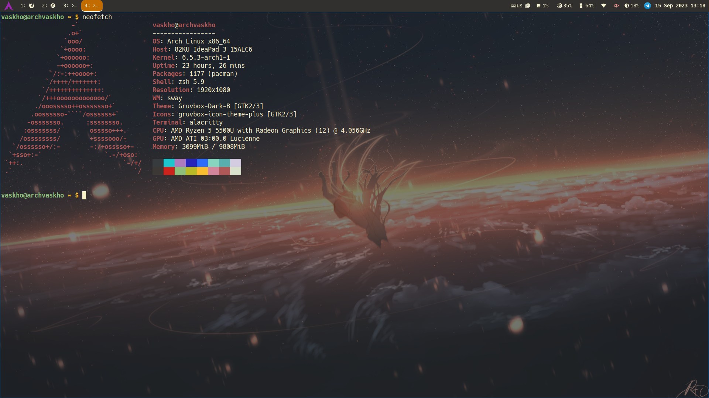
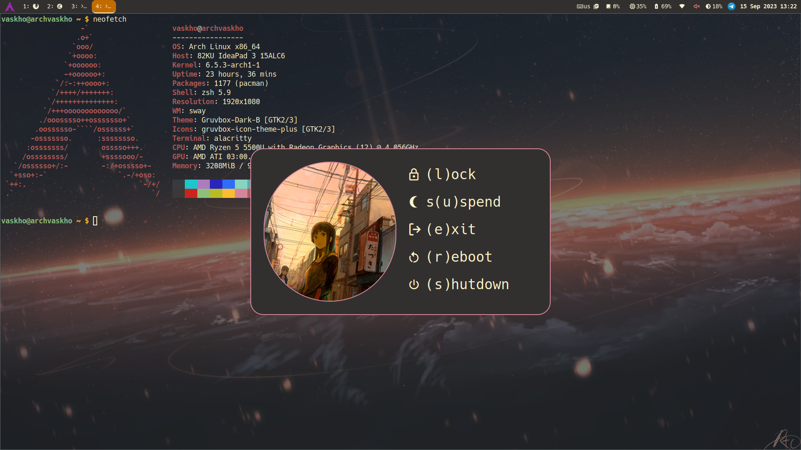
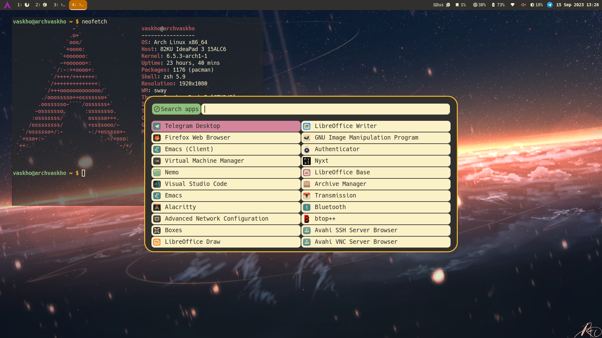
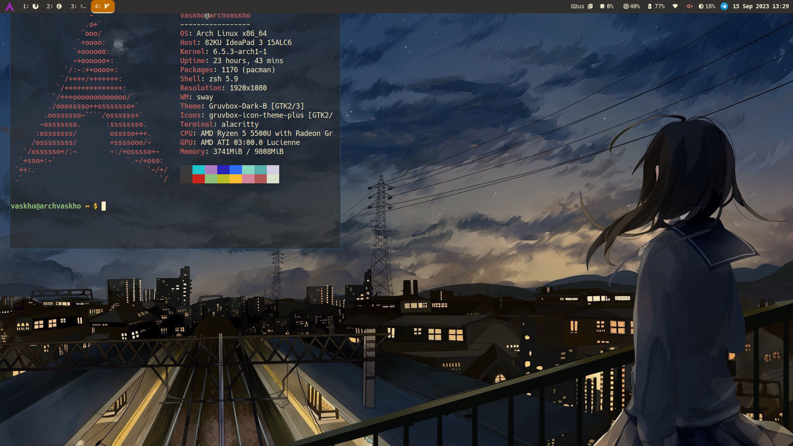

##  About

Here lies my sway config file along with waybar, rofi and sworkstyle. You can also find here all my favourite wallpapers which I use in my system.

## &nbsp;&nbsp;Preview









## &nbsp;&nbsp;Features

- Easy customization via `make.conf`
- Help menus for shortcuts in shutdown and screenshot modes
- Screenshots + screen recording
- Dynamic workspaces in bar via sworkstyle
- Custom themes support


## &nbsp;&nbsp;Quick start

Before starting an installation check whether you do have all necessary dependencies via `make check` and install those if you don't.

**Attention: Make sure that you have backup of the following directories, cause they will be replaced with current config:**
- ${HOME}/.config/sway
- ${HOME}/.config/waybar
- ${HOME}/.config/rofi
- ${HOME}/.config/sworkstyle
- ${HOME}/.config/wallpapers

Before running `make` you must remove abovementioned directories by yourself or with help of `make clean`.

```sh
git clone https://github.com/VasKho/sway-setup
git submodule update --init --recursive
make
```

### &nbsp;&nbsp;Requrements

To get this setup work you need to install some packages. Their list might be found either in `make check` output or in the table below.
If the package is marked with `*` then you can easily replace it in `make.conf`
Packages marked with `**` are optional, but config contains parts that depend on them.

| Package                  | Description                                                                            |
|--------------------------|----------------------------------------------------------------------------------------|
| `systemd`*               | This config config relies on `systemd` commands to login, suspend, reboot and poweroff |
| `wireplumber`*           | Client for pipewire audio                                                              |
| `brightnessctl`*         | Simple screen brightness manager                                                       |
| `playerctl`*             | Media player controller                                                                |
| `rofi`                   | Provides widgets for modes and menus                                                   |
| `wl-clipboard`           | CLI clipboard utility                                                                  |
| `autotiling`             | Helps to manage tiling layouts                                                         |
| `sworkstyle`             | Used for beautiful workspace names in waybar                                           |
| `foot`                   | Terminal                                                                               |
| `slurp`                  | Utility to select on screen with cursor (used in screenshots and recordings)           |
| `grim`                   | Screenshot tool                                                                        |
| `wf-recorder`            | Screen recorder                                                                        |
| `cliphist`               | Wayland clipboard manager                                                              |
| `swaylock`               | Screen lock utility (I prefer `swaylock-effects`)                                      |
| `mako`                   | Notification daemon                                                                    |
| `waybar`                 | Highly customizable Wayland bar for Sway and Wlroots based compositors                 |
| `swaybg`                 | Wallpaper tool                                                                         |
| `jq`                     | CLI JSON processor                                                                     |
| `wl-mirror`              | Tool to mirror screen                                                                  |
| `pipectl`                | Dependency of `wl-mirror`                                                              |
| `nm-connection-editor`** | GUI app to manage network connections configurations                                   |
| `blueberry`**            | GUI bluetooth connections manager                                                      |
| `networkmanager`**       | `nmtui` is used in config                                                              |
| `btop`**                 | More convenient than `htop`                                                            |
| `telegram-desktop`**     | Messenger                                                                              |


## &nbsp;&nbsp;Configuration

This repo contains `make.conf` file which is used to configure some variables during installation. All of them are listed in it. I've tried as hard as I could to make their names such as to make it easy to guess their meaning, so feel free to make little adjustments in this config via them.

## 󰌌&nbsp;&nbsp;Default mappings

| Shortcut                | Function                                 |
|:-----------------------:|:----------------------------------------:|
| `Super+Shift+c`         | Reload config                            |
| `Super+Enter`           | Run terminal                             |
| `Super+Shift+q`         | Kill active window                       |
| `Super+Shift+Space`     | Toggle floating mode for active window   |
| `Super+x`               | Run launcher                             |
| `Super+p`               | Open clipboard                           |
| `Super+Shift+p`         | Open clipboard for deleting              |
| `Super+f`               | Toggle fullscreen mode for active window |
| `Super+<number>`        | Change workspace (from 1 to 10)          |
| `Super+Shift+<number>`  | Move window to workspace                 |
| `Super+Shift+r`         | Start screen recording                   |
| `Super+Escape`          | Stop screen recording                    |
| `Super+m`               | Toggle messenger                         |
| `Super+Shift+e`         | Open powermenu                           |
| `Print`                 | Open screenshot menu                     |
| `XF86AudioMute`         | Mute audio                               |
| `XF86AudioMicMute`      | Mute micro                               |
| `XF86AudioRaiseVolume`  | Raise volume                             |
| `XF86AudioLowerVolume`  | Lower volume                             |
| `XF86MonBrightnessUp`   | Raise brightness                         |
| `XF86MonBrightnessDown` | Lower brightness                         |
| `XF86AudioPlay`         | Toggle audio playing                     |
| `XF86AudioNext`         | Next song                                |
| `XF86AudioPrev`         | Previous song                            |
| `Super+Shift+m`         | Start screen mirroring                   |

This table doesn't contain powermenu and screenshot shortcuts because you can find them in their menus.
